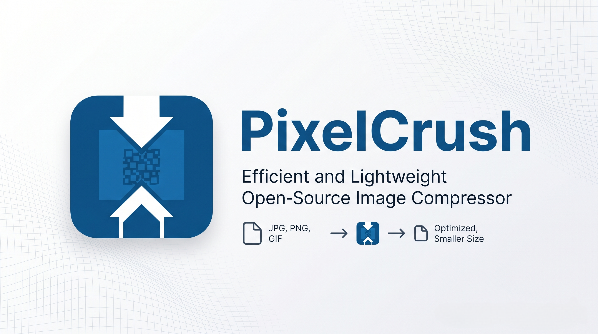

# PixelCrush — Image Optimizer



PixelCrush is a modern, blazingly fast **desktop image optimization** tool built with **Rust** and **Slint**. Drop in your images, pick a quality and output format per file, compress, and save — all locally, all instant.

---

## Features

- 🖼 **Drag & Drop** — Add multiple images at once by dragging them in
- ⚡ **Batch Compression** — Compress all images in one click with *Compress All*
- 🎚 **Per-Image Quality Slider** — Fine-tune quality from 1–100 (default: 90)
- 🔄 **Format Conversion** — Convert between JPEG, PNG, and WebP per image
- 🔍 **Before/After Comparison** — Interactive slider to compare original vs. compressed
- 💾 **Save Individually or All** — Save a single file or batch-export to a folder
- 🌙 **Dark UI** — Premium dark-mode interface powered by Slint
- 🔒 **100% Local** — No internet required, no data leaves your machine

---

## Download

Pre-compiled binaries for **Windows**, **macOS**, and **Linux** are available on the [**Releases page →**](https://github.com/torocruzand/PixelCrush/releases)

| Platform | File |
|---|---|
| Windows 64-bit | `pixelcrush-windows-x86_64.exe` |
| Windows 32-bit | `pixelcrush-windows-i686.exe` |
| macOS (Intel) | `pixelcrush-macos-x86_64` |
| macOS (Apple Silicon) | `pixelcrush-macos-aarch64` |
| Linux x86_64 | `pixelcrush-linux-x86_64` |

---

## Build from Source

### Prerequisites
- [Rust toolchain](https://rustup.rs/) (`stable`)
- Platform dev libraries:
  - **Linux**: `libxcb`, `libxkbcommon`, `libfontconfig`
    ```bash
    sudo apt-get install libxcb-shape0-dev libxcb-xfixes0-dev libfontconfig-dev libxkbcommon-dev
    ```
  - **Windows / macOS**: no extra dependencies

### Build & Run
```bash
git clone https://github.com/torocruzand/PixelCrush.git
cd PixelCrush
cargo run --release
```

---

## Running Unsigned Binaries

Since these releases are not code-signed, your operating system might warn you before opening them.
- **Windows**: You may see a "Windows protected your PC" SmartScreen popup. Click **More info**, then **Run anyway**.
- **macOS**: If you see an "App cannot be opened" warning, right-click (or Control-click) the application file and select **Open**. You may need to click **Open** again in the confirmation dialog.
- **Linux**: Remember to make the binary executable before running: `chmod +x pixelcrush-linux-x86_64`.

---

## Tech Stack

| Tool | Role |
|---|---|
| [Rust](https://www.rust-lang.org/) | Core logic, threading, performance |
| [Slint](https://slint.dev/) | Desktop GUI framework |
| [image](https://crates.io/crates/image) | Decoding & thumbnail generation |
| [mozjpeg](https://crates.io/crates/mozjpeg) | High-quality JPEG encoding |
| [oxipng](https://crates.io/crates/oxipng) | Lossless PNG compression |
| [libwebp](https://crates.io/crates/webp) | WebP encoding |
| [rfd](https://crates.io/crates/rfd) | Native file dialogs |

---

## License

MIT License — © 2026 [torocruzand](https://torocruzand.com)

---

## Built With Slint

> This application's GUI is powered by [**Slint**](https://slint.dev/) under the [Slint Royalty-Free License](https://slint.dev/pricing.html).

[](https://slint.dev/)
